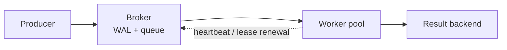

# TaskForge
A distributed task queue and job scheduler

## Project Description
Most backend systems eventually need to run work in the background; sending an email, retrying a web hook, resizing an image. This is eventually solved using SQS, RabbitMQ or Celery-on-Redis. This project builds that infrastructure from scratch, including the parts those tools hide: lease-based delivery, crash recovery via a write-ahead log, and horizontal scaling via consistent hashing.

## Features
- Durable queue: work accepted from producers, handed to a worker pool
- Crash-tolerant: a process dying mid-flight doesn't lose the job
- Retries failed jobs with exponential backoff
- Quarantines poison messages that repeatedly fail (dead-letter queue)
- Cron-style recurring job scheduling
- No external broker — no Redis, no RabbitMQ, no SQS

## Architecture Diagram
